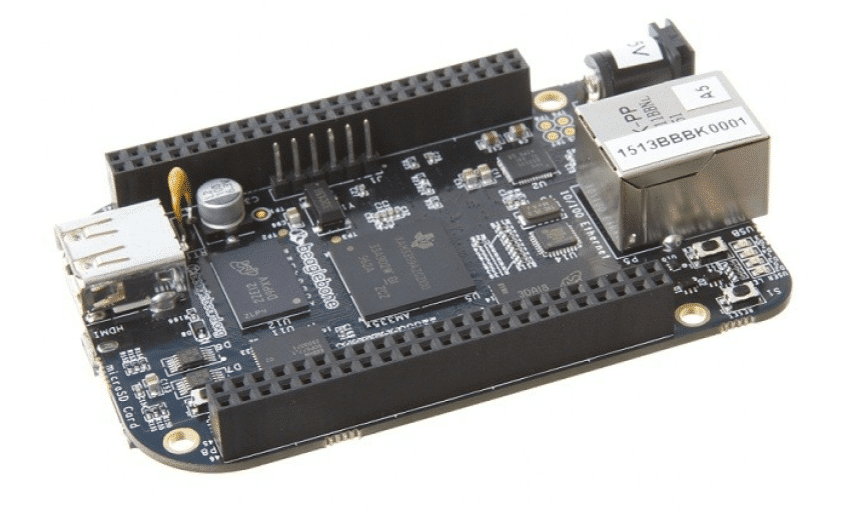
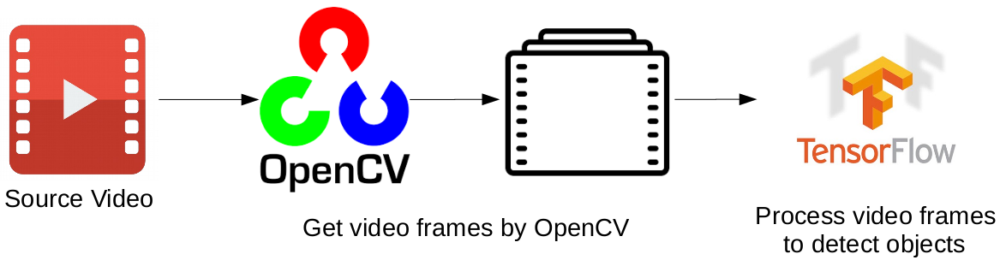
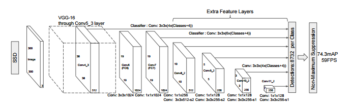

# Vehicle Feature Recognition
Project developed for the Embedded Systems Course (SEM0544 - 2020.1) of the Mechatronic Engineering Major - São Carlos School of Engineering - University of São Paulo (USP)

Read this in other language:
[_Português_](README.pt-BR.md)

## Table of Contents

- [Description](#Description)
- [Requirement](#Requirement)
- [Setup](#setup)
- [Conclusion](#Conclusion)
- [Future Work](#future-works)
- [Technologies](#technologies)
- [Reference](#reference)
- [Developers](#Developers)

## Description
This project focuses on the development of a vehicle feature recognition and license plate.


Using Beaglebone Black Rev C



## Requirement
### Hardware 
* [Beaglebone Black Rev C](https://www.filipeflop.com/produto/beaglebone-black-rev-c/)
* Power Converter circuit to power the BeagleBone through the 9V Battery
* [Intel® Movidius™ Vision Processing Unit (VPU)](https://software.intel.com/content/www/us/en/develop/tools/openvino-toolkit/hardware.html)
* USB Camera 720p
* Jumpers, protoboard, resistors

### Software
We recommended to use Ubuntu, but above is the Setup Environment for other OS
*   [Windows Setup](./windows.md)
*   [MacOs Setup](./mac.md)
*   [Linux Setup](./linux.md)
*   [Ubuntu 20.04 LTS](https://ubuntu.com/#download)
*   [Web Cam Interfacing](https://www.engineersgarage.com/contributions/web-cam-interfacing-with-beaglebone-black-part-10-15/)
*   [CAN BeagleBone](https://www.embarcados.com.br/can-com-beaglebone-black-e-python/)
*   [EPOS](https://github.com/griloHBG/passivity_project)
*   Intel® Distribution of OpenVINO™ toolkit 2019 R1 release
*   OpenCL™ Runtime Package
*   Node v6.17.1
*   Npm v3.10.10
*   MQTT Mosca\* server
*   Python 3.5 or 3.6

### Functional requirements
 * The system should identify the condominium car and open the gate for it.
* The system must have an interface that allows to read authorizations for visitors' cars to enter (commonly known as "the owner generates a QR code for the visitor, he puts it in the scanner of the intercom, and opens the gate if the QR hits the authorized QR" or "a camera that checks the signs is broken, but the owner can show his QR and open the gate ")

### Non-functional requirements
* The system must respond to 90% of checks in less than 5 seconds (or any arbitrary number).
* The system must properly authorize 100% of the time (it is preferable that it does not recognize an authorized license plate and excludes a secondary registration check of an unauthorized license plate and lets someone in).
* The system must load the incoming carriage and activate the gate actuator after 2 seconds of entry.


## Tracker


## Model
[SSD Model](https://towardsdatascience.com/understanding-ssd-multibox-real-time-object-detection-in-deep-learning-495ef744fab)



## Setup

### Install Intel® Distribution of OpenVINO™ toolkit

Refer to https://software.intel.com/en-us/articles/OpenVINO-Install-Linux for more information about how to install and setup the Intel® Distribution of OpenVINO™ toolkit.

You will need the OpenCL™ Runtime Package if you plan to run inference on the GPU. It is not mandatory for CPU inference. 

### Install Nodejs and its depedencies

- This step is only required if the user previously used Chris Lea's Node.js PPA.

	```
	sudo add-apt-repository -y -r ppa:chris-lea/node.js
	sudo rm -f /etc/apt/sources.list.d/chris-lea-node_js-*.list
	sudo rm -f /etc/apt/sources.list.d/chris-lea-node_js-*.list.save
	```
- To install Nodejs and Npm, run the below commands:
	```
	curl -sSL https://deb.nodesource.com/gpgkey/nodesource.gpg.key | sudo apt-key add -
	VERSION=node_6.x
	DISTRO="$(lsb_release -s -c)"
	echo "deb https://deb.nodesource.com/$VERSION $DISTRO main" | sudo tee /etc/apt/sources.list.d/nodesource.list
	echo "deb-src https://deb.nodesource.com/$VERSION $DISTRO main" | sudo tee -a /etc/apt/sources.list.d/nodesource.list
	sudo apt-get update
	sudo apt-get install nodejs
	```

### Install the following dependencies

```
sudo apt update
sudo apt-get install python3-pip
pip3 install numpy
pip3 install paho-mqtt
sudo apt install libzmq3-dev libkrb5-dev
sudo apt install ffmpeg
```
### Install npm

We need to run in separate terminals these items below for this application to work:

-   MQTT Mosca server 
-   Node.js* Web server
-   FFmpeg server
     
Go <path_directory>
```
cd <path_directory>
```
* For mosca server:
   ```
   sudo npm install npm -g 
   rm -rf node_modules
   npm cache clean
   npm config set registry "http://registry.npmjs.org"
   npm install
   ```

* For Web server:
  ```
  cd ../ui
  npm install
  ```
## Configure the application

### What model to use

By default, this application uses the **vehicle-license-plate-detection-barrier-0106** Intel® model, that can be accessed using the **model downloader**.

#### Download the __.xml__ and __.bin__ files

Go to the **model downloader** directory:

  ```
  cd /opt/intel/openvino/deployment_tools/tools/model_downloader
  ```

Specify which model to download with `--name`.
- To download the person-detection-retail-0013 model, run the following command:

  ```
  sudo ./downloader.py --name vehicle-license-plate-detection-barrier-0106
  ```
- To optimize the model for FP16, run the following command:
   ```
   sudo ./downloader.py --name vehicle-license-plate-detection-barrier-0106
   ```

## Run the application

Go to car-detection directory:
```
cd <path_directory>
```
### Step 1 - Start the Mosca server

```
cd webservice/server/node-server
node ./server.js
```

You should see the following message, if successful:
```
Mosca server started.
```

### Step 2 - Start the GUI

Open new terminal and run below commands.
```
cd ../../ui
npm run dev
```

You should see the following message in the terminal.
```
webpack: Compiled successfully
```

### Step 3 - FFmpeg Server

Open new terminal and run the below commands.
```
cd ../..
sudo ffserver -f ./ffmpeg/server.conf
```

### Step 4 - Run the code

Open a new terminal to run the code.

#### Setup the environment

You must configure the environment to use the Intel® Distribution of OpenVINO™ toolkit one time per session by running the following command:
```
source /opt/intel/openvino/bin/setupvars.sh -pyver 3.5
```
## Conclusion
One of the problems found in the project was the interface with the DC motor to trigger the opening of the gate. The openVINO system was made for amd64 processors but it was found to work perfectly in ARM architecture (Raspberry Pi) the same as BeagleBone Black.

## Future works
For future work the ideal is to perform the interface of the DC motor and the assembly of the prototype on the circuit board, no experimental approach has been made, only the validation of the computer vision model and the functioning of the software, that is, we do not know the behavior in real time.

## Reference

- [Udacity Intel Edge Course](https://www.udacity.com/course/intel-edge-ai-for-iot-developers-nanodegree--nd131)
- [ONNX Models](https://github.com/onnx/models)
- [TensorFlow Coco SSD](https://github.com/tensorflow/tfjs-models/tree/master/coco-ssd)
- [People Counter App](https://github.com/intel-iot-devkit/people-counter-python)

## Technologies
- Python
- C++
- Intel® Distribution of OpenVINO™ Toolkit
- JavaScript

## Developers
- [Eduardo Key Shiratori](https://github.com/EduardoKeyS)
- [João Pinheiro](https://github.com/joaomh)
- [Raphael Hideki](https://github.com/raphaelyokosawa/)
- [Reon Fujieda](https://github.com/reonfk)
- [Valter Teodoro](https://github.com/valterteodoro)
